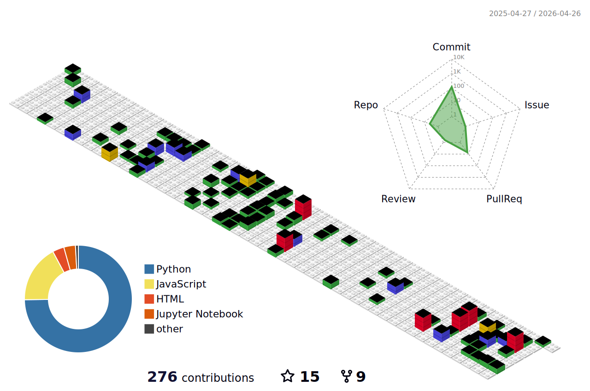

  <!--

  -->
  

<h2 align='left'>  Motto as a developer  </h2>

<h3>
  "깊이 천착하는  Developer"  
</h3>
La douleur passe, 
la beauté reste, le code reste. 
   
고통은 지나간다, 
아름다움은 남는다, 코드도…

___

<h3>
 ⭐ Skill ⭐ 
</h3>

  
  
&nbsp;&nbsp;
  

  <!--
  
  
  
  
  -->

___

<h3>
 ♟ DL/ML ♟ 
</h3>
 

  
  
   
  
   
  
  &nbsp;&nbsp;&nbsp;
  
    <!--
  
  -->

___

 🛠 Tool 🛠 

  
  
  
   
  
  
  
  
   
  
   
  
  
   
  
  
  
   

___

# My Project

> * NLP
>> * [[SideProject] 심야식당](https://www.notion.so/ppt-0e62ef1530df4a1c9141d0eba481fe32)

> * CV
>> * [[SideProject] CatchV](https://www.notion.so/da92758cda7743d09a4b6931a3605e16)

> * Back_End
>> * [[SideProject] 어디갈래?](https://www.notion.so/ppt_-bf44dd782a7e4a919b50d95d03a00709) 
빅데이터를 활용한 국민 행복 서비스 발굴 경진대회  ‘사회보장 유레카 2022’ 우수상 수상
<a href="https://www.etnews.com/20220720000253">(한국사회보장정보원장상)</a>

> * BootCamp
<!--
>> * ML
>>> * [[Kaggle]Porto Seguro 데이터셋 연습](https://github.com/xilverh0ya/MyStudy/tree/master/06_Mini_Project/Kaggle_01_Porto%20Seguro%20Dataset%20Prac)
-->
>> * DL
>>> * [[Kaggle]Tweet Disaster NLP Basic](https://github.com/xilverh0ya/MyStudy/tree/master/06_Mini_Project/Kaggle_02_Narutal%20Language%20Processing%20with%20Disaster%20Tweets)

___

  
   <!--

      

 -->      
