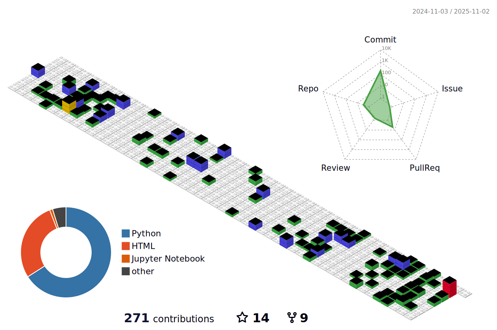

<h1>
  "깊이 천착하는  Developer"  
</h1>
___
<h2 align='left'>  Motto as a developer  </h2>

La douleur passe, 
la beauté reste, le code reste. 
   
고통은 지나간다, 
아름다움은 남는다, 코드도…

___

 ⭐ Skill ⭐ 

  
  
  
   
  
  <!--
  
  
  
  -->

___

 🛠 Tool 🛠 

  
  
  
   
  
  
  
  
   
  
   
  
  
   
  
  
  
   

___

 ♟ DL/ML ♟ 

  
  
   
  
   
  
  
  

___

# My Project

> * NLP
>> * [[SideProject] 심야식당](https://github.com/xilverh0ya/Midnight_Diner)

> * CV
>> * [[SideProject] CatchV](https://github.com/tmdqja75/CleanData)

> * BootCamp
>> * ML
>>> * [[Kaggle]Porto Seguro 데이터셋 연습](https://github.com/xilverh0ya/MyStudy/tree/master/06_Mini_Project/Kaggle_01_Porto%20Seguro%20Dataset%20Prac)
>> * DL
>>> * [[Kaggle]Tweet Disaster NLP Basic](https://github.com/xilverh0ya/MyStudy/tree/master/06_Mini_Project/Kaggle_02_Narutal%20Language%20Processing%20with%20Disaster%20Tweets)

___

  
 

             

