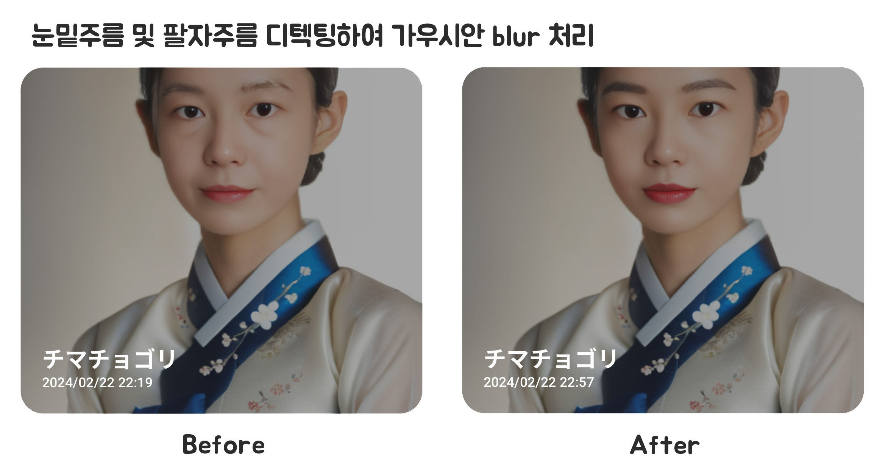
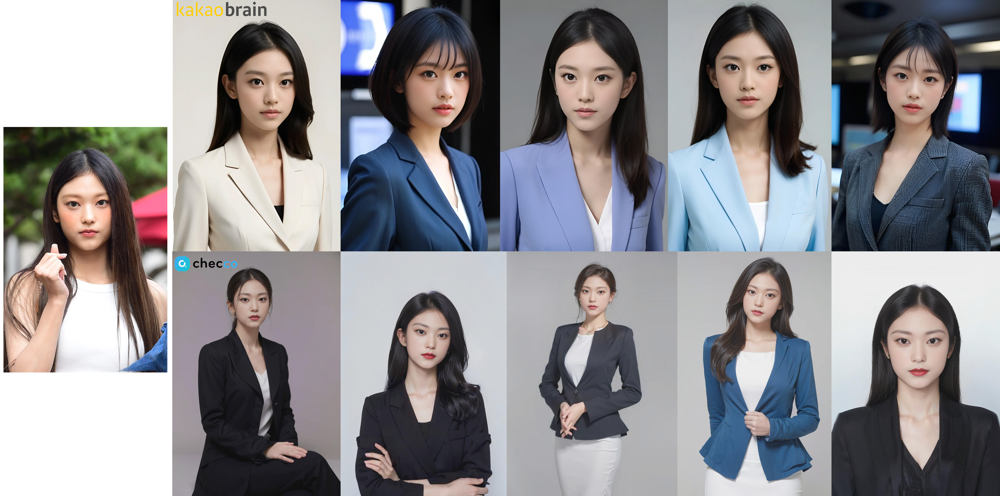
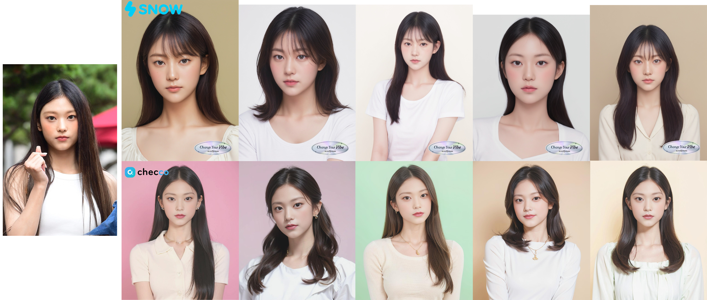

## AI Snap Project

### 프로젝트 개요
- **프로젝트명**: AISnap  
- **기간**: 2023.07 ~ 2023.12  
- **목표**: 사용자 사진 중 최적의 사진을 선별하고, DeepFake 및 이미지 처리 기술을 결합해 자연스럽고 만족도 높은 프로필 이미지를 자동 생성하는 시스템 개발  
- **역할**: 알고리즘 설계 및 모델 구현, 얼굴 특징 추출/분석, 이미지 후처리 로직 개발  

---

### 주요 내용 및 기여

1. **최적의 사진 선택 알고리즘 개발**  
   - **사진 길이와 얼굴 너비 비율**, 정면 정도, 눈 특징, 입의 대칭성, 머리카락 위치 등을 **수치화**하여  
     _사용자가 업로드한 여러 장의 사진_ 중 **가장 적합한 프로필 후보**를 자동으로 선별  
   - Python + OpenCV + ML 모델을 활용해 **사용자의 만족도를 극대화**할 수 있는 지표(점수) 산출  

2. **이미지 유사성 및 결과 만족도 향상**  
   - **DeepFake 기술**(Face Swap)을 적용해 **사용자 본인의 특징을 최대한 반영**하면서도 **깨끗하고 정돈된 이미지**를 생성  
   - **주름 부위 자동 감지 및 가우시안 블러 처리** 로직을 구현하여, 약점은 가리고 **자연스러움은 살린 표현** 제공  

3. **다양한 배경과 분위기 구현**  
   - **Stable Diffusion**의 `Text2Img`와 `Img2Img` 기능을 효과적으로 활용  
   - 여러 콘셉트(예: 스튜디오프로필, 도쿄스냅, 할로윈 등)에 맞춰 **다양한 배경과 분위기**를 **자동 생성**  
   - 사용자별로 취향을 선택할 수 있도록 하여 **개인화된 이미지 경험** 제공

---

### 주요 성과

- **경쟁력 강화**: 기존 서비스(카카오브레인 칼로프로필, SNOW AI프로필) 대비 **더 자연스럽고 고퀄리티**의 이미지 생성 

- **플랫폼 가입자 수 300% 증가**: AI Snap 기능 출시 후 Checco 플랫폼 가입자가 **300%** 늘어나며 **큰 호응**  
- **콜라보 프로젝트 성과**: 일본 대형 이커머스와 **크리스마스 시즌 콜라보**를 진행하여 서비스 **인지도 및 매출 증대**에 기여
---

### 기술 스택

- **언어/프레임워크**: Python, PyTorch, OpenCV  
- **딥러닝 모델 및 라이브러리**: Stable Diffusion(Img2Img, Text2Img), Face Swap(DeepFake), Face Restore  
- **기타**: Docker, Git

---
  