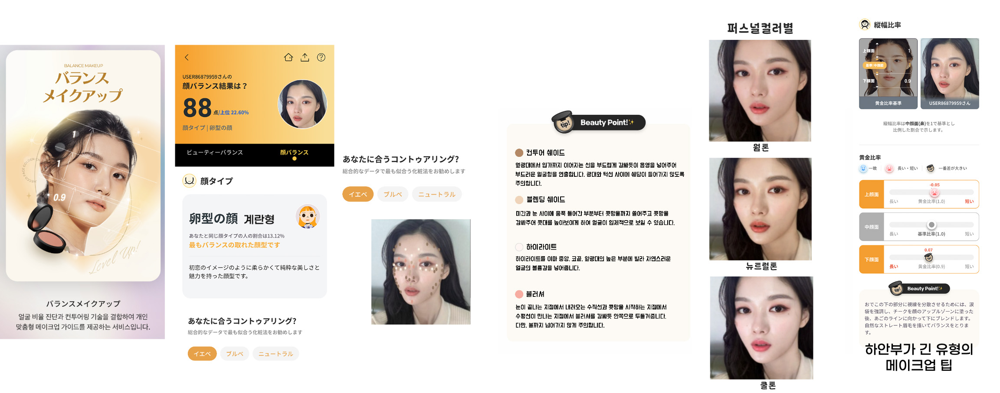

## BalanceMakeUp Project

### 프로젝트 개요
- **프로젝트명**: BalanceMakeUp  
- **기간**: 2023.03 ~ 2023.07  
- **목표**: 사용자 얼굴 특징을 정밀하게 분석하여 **맞춤형 메이크업 가이드**를 제공하는 서비스 개발  
- **역할**: 얼굴 검출 및 특징점 분석 알고리즘 구현, ML 모델 설계, 메이크업 추천 로직 구현  

---

### 주요 내용 및 기여

1. **정밀한 얼굴 특징 감지 시스템 구현**  
   - **Google MediaPipe의 FaceMesh**를 활용하여 **얼굴의 468개 지점을 정확히 감지**  
   - 다양한 각도와 얼굴 유형에도 대응해 **높은 분석 정확도** 확보  

2. **얼굴형 분류 모델 개발**  
   - 감지된 **468개 지점 데이터**를 기반으로 **7가지 얼굴형**을 분류하는 모델 개발  
   - 분류 결과를 통해 **개인화된 메이크업 가이드** 제공의 기초 마련  

3. **과학적 기반의 얼굴 비율 분석 시스템 구축**  
   - **악안면성형 및 재건학회 연구 결과**를 바탕으로 **11가지 얼굴 비율 측정 기술** 개발  
   - 각 개인의 얼굴 특성을 **이상적인 비율과 비교·분석**하여 사용자 인사이트 제공  

4. **맞춤형 메이크업 가이드 시스템 개발**  
   - 얼굴형 진단 결과에 따른 **맞춤형 컨투어링** 메이크업 가이드 제공  
   - **피부톤(쿨톤, 웜톤, 뉴트럴톤)** 분석 후 **개인화된 제품 추천** 및 예시 제공  
   - Checco 뷰티 플랫폼 내에서 **종합적이고 개인화된 메이크업 서비스**를 구현

---

### 주요 성과

- **7가지 얼굴형 정확 분류 모델 완성**: 개인화된 뷰티 서비스의 핵심 인프라를 구축  
- **11가지 얼굴 비율 분석 기술**: 과학적 근거에 기반해 **서비스 신뢰도** 및 **사용자 만족도** 향상  
- **플랫폼 가치 제고**: Checco 뷰티 플랫폼 내에서 **맞춤형 메이크업 가이드**를 성공적으로 출시, 사용자 체류시간 및 재방문율 상승  

---

### 기술 스택

- **언어/프레임워크**: Python, TensorFlow/PyTorch  
- **얼굴 인식/분석**: Google MediaPipe FaceMesh, OpenCV

---